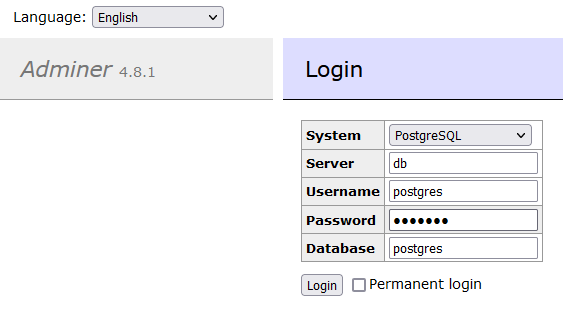

# Postgres setup

after running `make compose_up`, go to <http://localhost:8080/> in a web browser. You can login by changing the `System` to PostgreSQL, and use the username `postgres` and the password you set in the compose file. The default database is postgres

  
